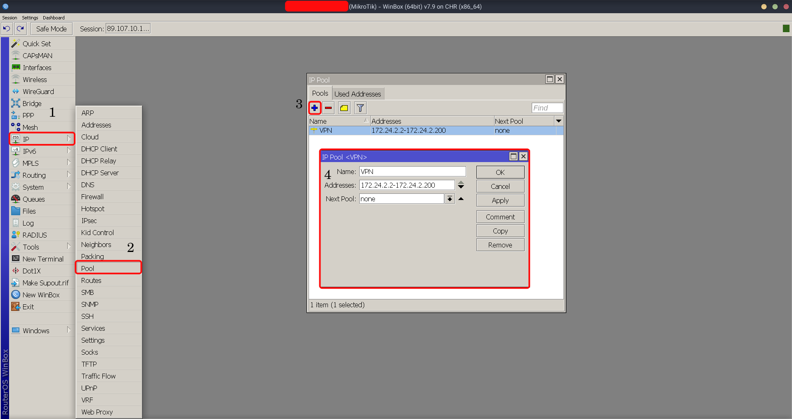
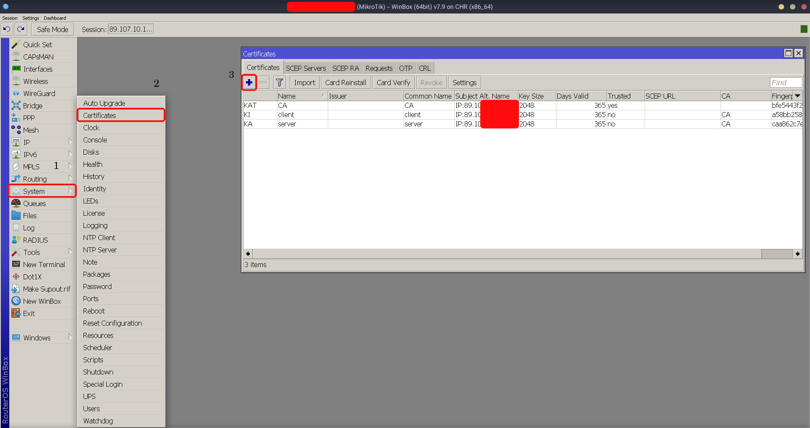
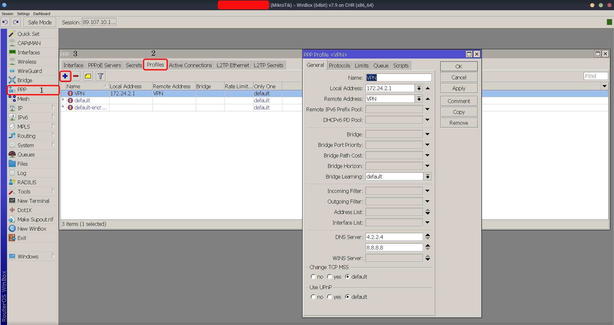
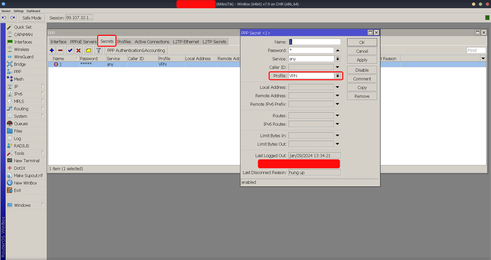
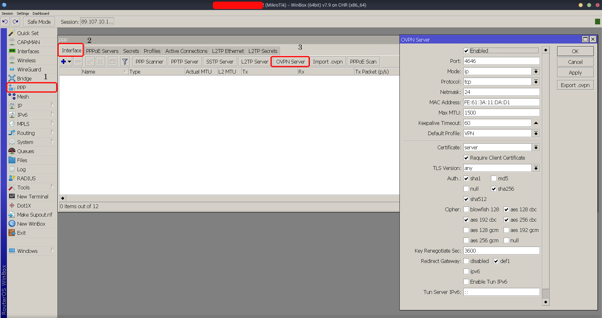
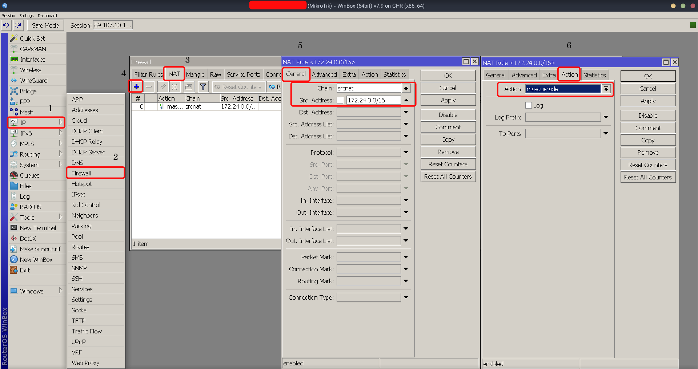

# Mikrotik-routeros
**Install and run mikrotik routeros using docker**

If you want to install a Mikrotik on the server, but also use the rest of the server, you should use Docker.

## Pull the image
```sh
docker pull ghcr.io/im-ecorp/mikrotik-routeros:latest
```
or
```sh
docker pull hossein3piol/mikrotik-routeros:latest
```
You can use version tag instead of `latest`

for example `hossein3piol/mikrotik-routeros:7.9`

## Run container using command

* command line

  ```sh
  docker run -itd \
    --name mikrotik \
    -p 80:80 -p 443:443 -p 1194:1194 -p 8291:8291 -p 8729:8729 \
    --cap-add=NET_ADMIN \
    --device=/dev/net/tun \
    ghcr.io/im-ecorp/mikrotik-routeros:latest
  ```

to stop the container

```sh
docker stop mikrotik
docker rm mikrotik
```

## Run container using compose

* compose file

  ```
  version: '3.9'

  services:
     routers:
         container_name: "mikrotik"
         image: ghcr.io/im-ecorp/mikrotik-routeros:latest
         privileged: true
         ports:
             - "21:21"    #ftp
             - "22:22"    #ssh
             - "23:23"    #telnet
             - "80:80"    #www
             - "443:443"  #www-ssl
             - "1194:1194"  #OVPN
             - "1450:1450"  #L2TP
             - "8291:8291"  #winbox
             - "8728:8728"  #api
             - "8729:8729"  #api-ssl
             - "13231:13231"  #WireGuard
         cap_add:
             - NET_ADMIN
         devices:
             - /dev/net/tun
  ```
If you want to give your container static IP, its example is included in the project

## Configure Openvpn


<details>
  <summary>Click for Openvpn configuration details</summary>

### Openvpn

- first of all we need add private range IP address for each client to have an IP address

  I use 172.24.0.0/16 rage. you can use other range like 192.168.0.0/16
  

- after setting IP pool, must get certificate for Openvpn
  

- crete profile for Openvpn
  

- add new client in secret tab
  

- create Openvpn profile on interface tab
  
  I use `4646` port for Openvpn. You can use other ports


- Finally, in order for each configuration to connect to the Internet, the firewall rule must be set
  

</details>


## A Special Thanks to
- [lordbasex](https://github.com/lordbasex)

## If this project is helpful to you, you may wish to give it a🌟
- USDT (TRC20): `TH1iDsFr2wjgpptghFBn6h7DVt88pp5WoH`
                        
## Stargazers over time
[](https://starchart.cc/im-ecorp/mikrotik-routeros)
