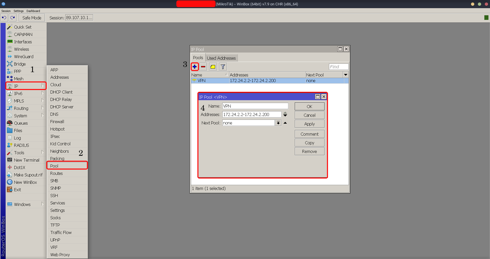
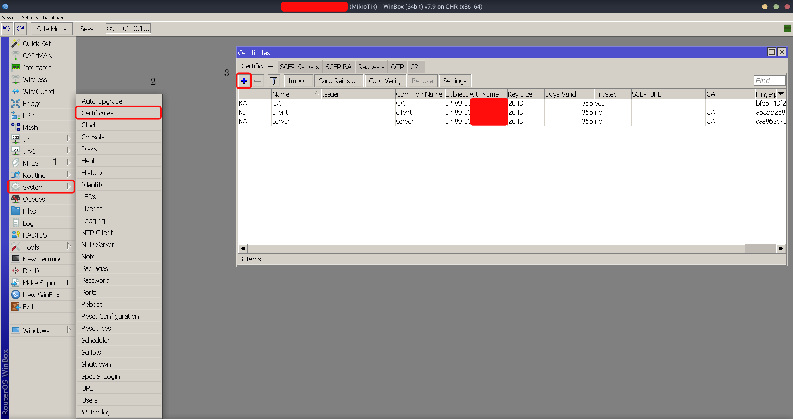
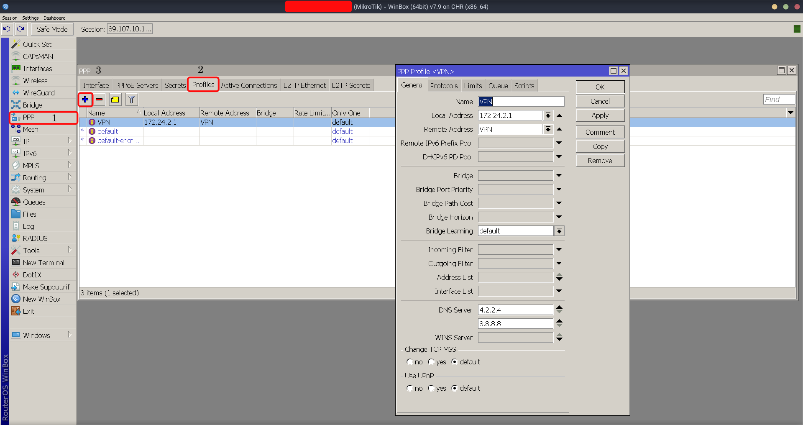
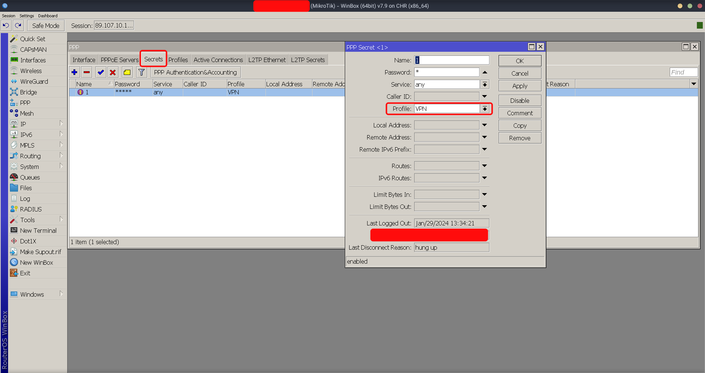
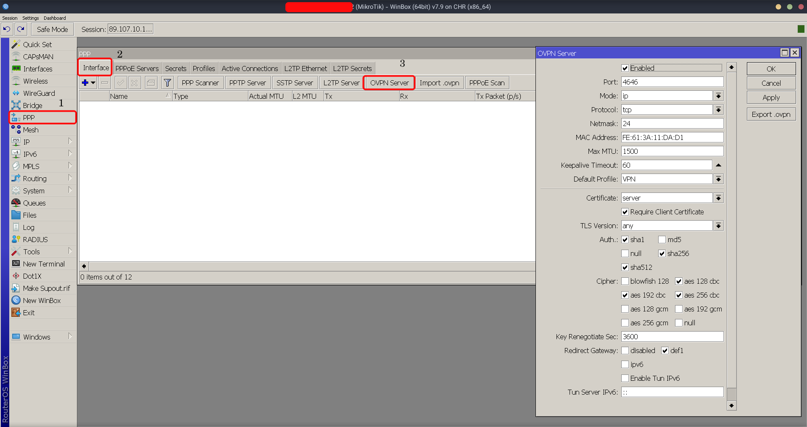
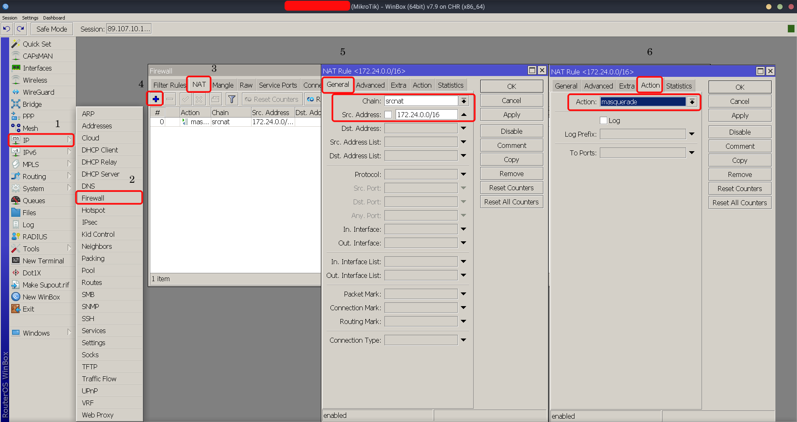

# MikroTik RouterOS on Docker

A highly optimized and production-ready Dockerized environment for running MikroTik RouterOS (CHR) using QEMU. This project allows you to seamlessly deploy MikroTik on a Linux server while retaining full access to your host OS and its existing services.

## Key Features

- **Persistent Storage:** Prevents configuration loss on container restarts or rebuilds by keeping the virtual hard drive safe on the host.
- **Host-to-Guest File Sharing:** Mounts a local host directory as a virtual FAT drive directly inside the MikroTik File Manager.
- **Safe SSH Access:** Re-routes the MikroTik SSH port to prevent conflicts with the host machine's SSH daemon.
- **Dynamic Port Range:** Pre-allocates a wide range of open ports for custom MikroTik services without requiring Docker restarts.
- **Version Management:** Easily switch between RouterOS versions using environment variables.

---

## Prerequisites

- Docker
- Docker Compose (v2 recommended)

## Quick Start

### 1. Clone the repository
```sh
git clone [https://github.com/hossein3piol/mikrotik-routeros.git](https://github.com/hossein3piol/mikrotik-routeros.git)
cd mikrotik-routeros
```

### 2. Configure Environment Variables
Create a `.env` file in the root directory to specify your desired RouterOS version. If omitted, the `latest` tag will be used.
```sh
echo "ROUTEROS_VERSION=7.21.4" > .env
```

### 3. Start the Container
Run the following command to build the image (if not pulled) and start the environment in the background:
```sh
docker-compose up -d
```

---

## Architecture & Configuration Details

### Directory Structure & Volumes
This setup utilizes two main directories mapped to the host:
* `./data`: Stores the primary `chr.vdi` virtual drive. This ensures your router's configurations, users, and licenses survive container recreation.
* `./shared`: Acts as a bridge between the Linux host and the RouterOS guest. Files placed here will automatically appear inside the MikroTik **File Manager** as an attached drive (using QEMU's virtual FAT feature).

### Networking and Ports
By default, Docker's `bridge` network is utilized to maintain host stability. 
* **Winbox (8291):** Fully exposed for GUI management.
* **SSH (2222):** Mapped to port `2222` externally to avoid locking you out of your Linux host's SSH (port 22). To access MikroTik via SSH, use: `ssh admin@<SERVER_IP> -p 2222`
* **Custom Services Range (9000-9100):** A block of 100 ports is exposed by default. If you need to change a default MikroTik service port, assign it within this range to ensure immediate accessibility without modifying `docker-compose.yml`.

To stop and remove the container:
```sh
docker-compose down
```

---

## Advanced: OpenVPN Configuration

<details>
  <summary>Click to expand step-by-step OpenVPN configuration guide</summary>

1. **IP Pool Setup:** Add a private IP range for clients. For instance, `172.24.0.0/16` or `192.168.0.0/16`.
   

2. **Generate Certificates:** Proper certificates must be acquired/generated for OpenVPN authentication.
   

3. **Create OpenVPN Profile:** Set up the routing profile for your VPN clients.
   

4. **Add Secrets (Clients):** Define user credentials in the Secrets tab.
   

5. **Interface Configuration:** Create the OpenVPN Server binding in the interfaces tab. (Example uses port `4646` instead of the default `1194`).
   

6. **Firewall / NAT:** Crucial step: Configure the masquerade rule in the IP -> Firewall -> NAT tab so clients can reach the internet.
   

</details>

---

## Acknowledgments
A special thanks to the original contributors and inspirations for this setup:
- [lordbasex](https://github.com/lordbasex)

## Support
If you found this project helpful in your infrastructure or daily work, consider supporting its continuous development:
- **USDT (TRC20):** `TH1iDsFr2wjgpptghFBn6h7DVt88pp5WoH`

---
[](https://starchart.cc/im-ecorp/mikrotik-routeros)
```


